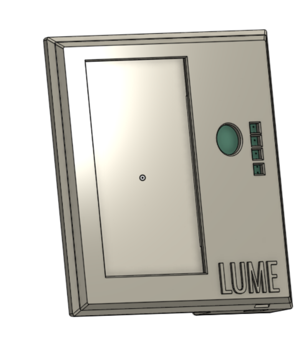
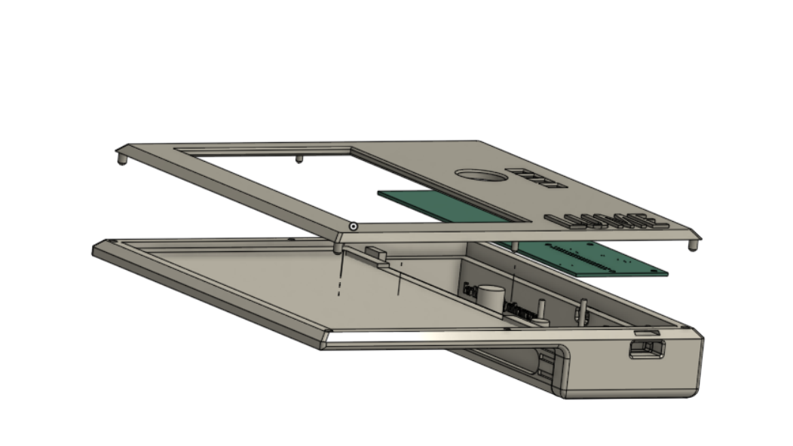
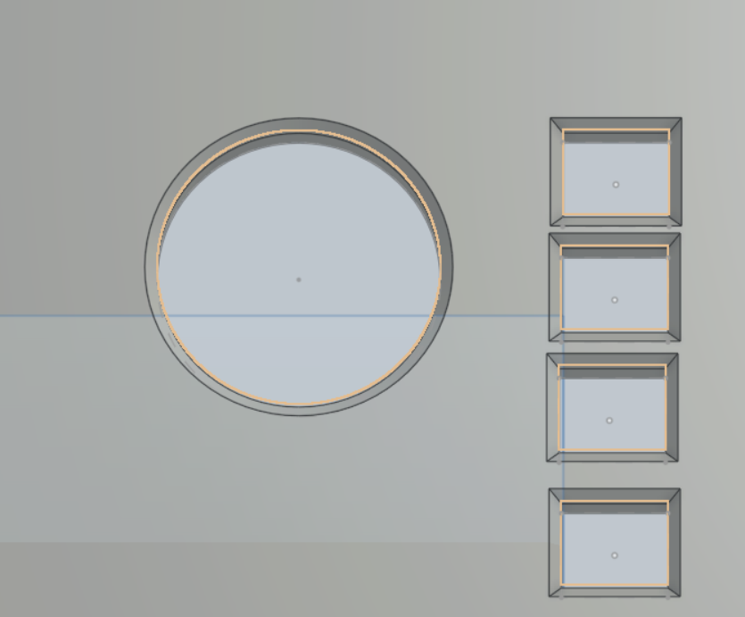
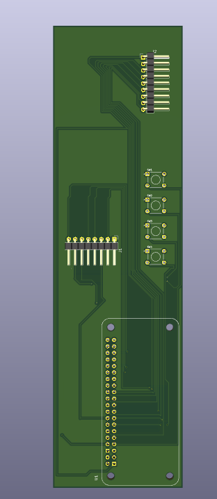
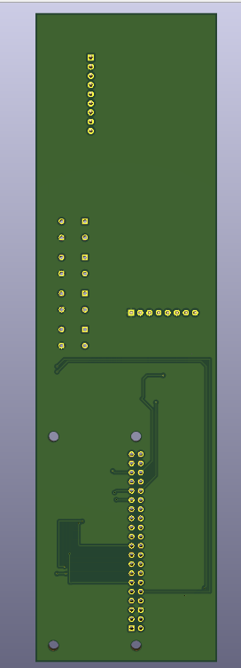
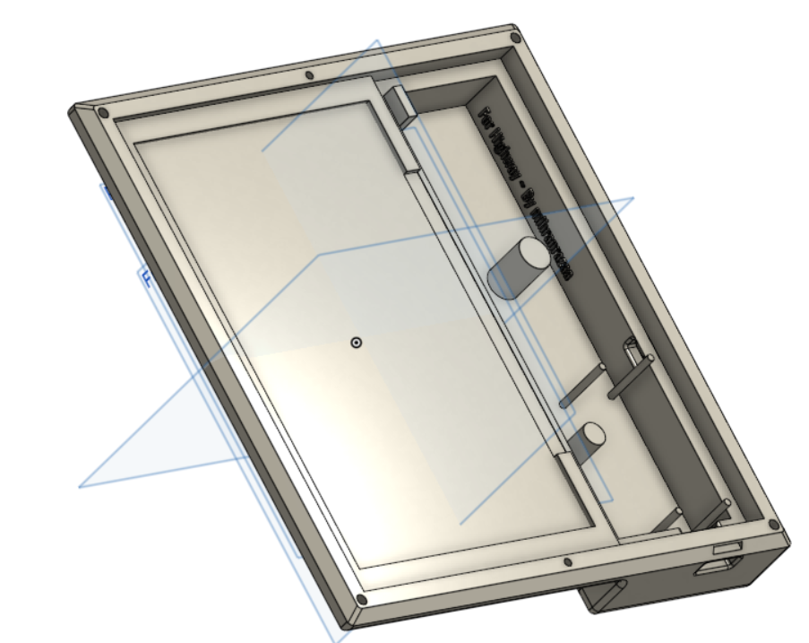
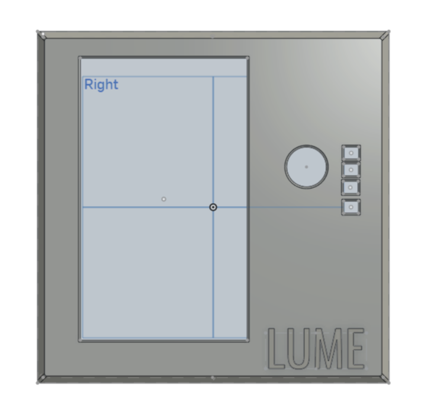
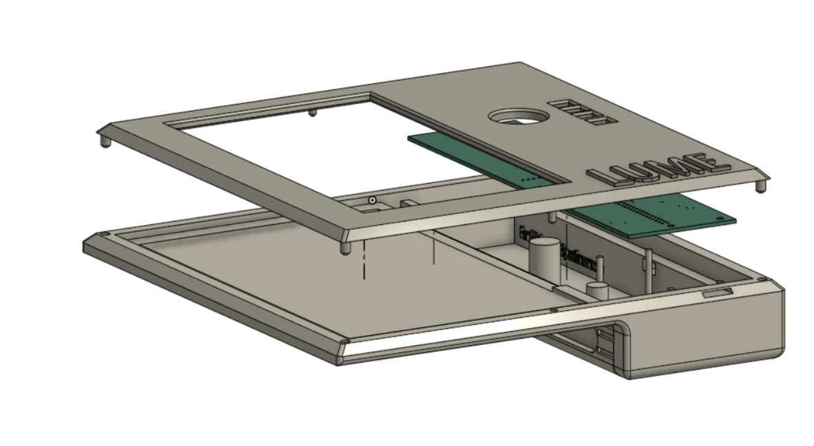
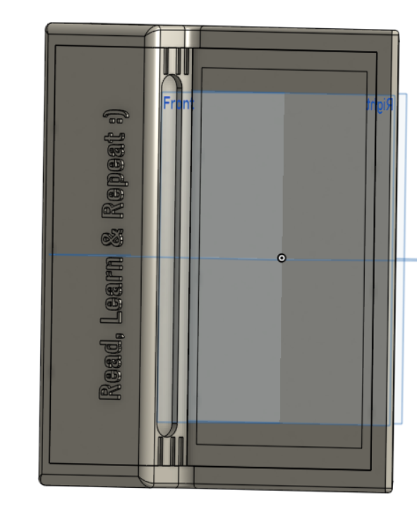

# Lume

An Open Source alternative of Kindle which gives you freedom to download and read anything you want.

----

## Overview 

Lume is a open source eBook Reader made for people who value freedom, simplicity and are fed up by the limitations and companies not valuing ownership . With Lume, you're free to choose how you read and what you install.

---

## Specifications
### Features(V0.1)

- Simple Menu System
- Bookmark System
- Joystick for smooth navigation
- Reading files ofc
- Offline-First
- approx1 week battery life (on medium usage)

### Hardware Support

- 7.5inch E-ink display
- Raspberry PI Zero 2w
- 5 way joystick navigation
- 4 Push buttons

### Controls

- **Joystick : Navigate menu items
- **Joystick : Turn pages while reading
- **Joystick : Select item
- **Button 1 : Return to menu
- **Button 2 : Back/Return to menu
- **Button 3 : Bookmark current page
- **Button 4 : Settings

---
## Files to Build

### PCB

The files for the PCB and Schematics are available in the PCB folder and gerber files are added in the Production folder..

### 3D Case(CAD)

The step files for the keyboard are available in the CAD folder and also in the Production Folder.

**BASE**

**PLATE**

---
## Images

---
## BOM

| Components            | Quantity | Price       | Link                                                                                                                                                                                      |
| --------------------- | -------- | ----------- | ----------------------------------------------------------------------------------------------------------------------------------------------------------------------------------------- |
| Raspberry pi zero 2w  | 1        | 16USD       | [Available](https://www.fabtolab.com/raspberry-pi-zero-2-w-rp3a0-1ghz-quad-core-64-bit-arm-cortex-a53-cpu-512mb-sdram-wireless-lan-mini-hdmi-port-micro-usb?search=Raspberry%20pi%20zero) |
| 7.5inch E-ink Display | 1        | 63USD       | [Available](https://hubtronics.in/7-5-inch-e-paper-hat?search=7.5%20inch%20e%20ink%20)                                                                                                    |
| 5D Joystick           | 1        | 0.58USD     | [Available](https://hubtronics.in/5d-rocker-joystick?search=joystick)                                                                                                                     |
| Tactile push buttons  | 4        | 0.28USD     |                                                                                                                                                                                           |
| PCB                   |          | approx10USD |                                                                                                                                                                                           |
| UPS                   | 1        | 27USD       | [Available](https://hubtronics.in/ups-hat-c?search=ups%20hat%20)                                                                                                                          |

**Total ::  110-130USD**

---
## Next Update

- Add more support for different file types
- More Reading features
- Ability to transfer files via Wifi or Bluetooth 
- Progress bar

---
## Extra Stuff

### Gratitude
- Thanks to Hackclub for making me do this brilliant project, More coming :).
- Thanks to my potato for helping me till the end.
- Thanks to myself for completing the project and not getting distracted with another project.
- And Thank you for Reading?

### Inspiration
I always wanted a ebook reader and i was thinking of buying kindle but then got to know it's limitations so why not build my own :).

### Challanging
Building the custom case.. i don't have the words to express my pain...

---

## End
Check my [BLOG](https://mihranrazaa.pages.dev/)
~ mihranrazaa

BYEEE
